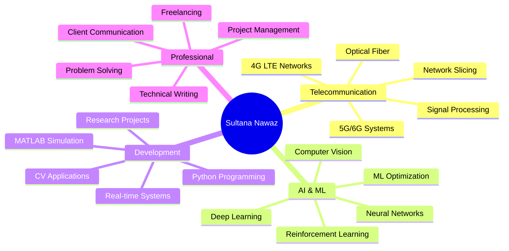

<div align="center">
  
# 👋 Hi, I'm Sultana Nawaz


### 🎓 Telecommunication Engineering Student
### 🚀 Bridging AI with Next-Gen Wireless Networks

<p align="center">
  
  
</p>

[](https://www.linkedin.com/in/sultana-nawaz-95155b328/)
[](sultananawaz1460@gmail.com)
[](https://www.fiverr.com/s/7YpPxGx)
[](YOUR_PORTFOLIO_URL)

</div>

---

## 🌟 About Me

```python
class SultanaNawaz:
    def __init__(self):
        self.role = "Telecommunication & AI Engineer"
        self.location = "Wah Cantt, Punjab, Pakistan"
        self.education = "B.Sc. Telecommunication Engineering @ UET Taxila"
        self.research_interests = [
            "5G/6G Network Optimization",
            "AI-Driven Wireless Systems",
            "Deep Reinforcement Learning for Networks",
            "Optical Fiber Communication",
            "Computer Vision Applications"
        ]
        self.current_focus = "Network Slicing with Deep RL"
        self.future_goal = "Revolutionize Wireless Networks with AI"
    
    def say_hi(self):
        print("Thanks for stopping by! Let's build the future of communication together!")

me = SultanaNawaz()
me.say_hi()
```

<div align="center">
  
### 💡 *"Transforming Wireless Communication with Artificial Intelligence"*

</div>

---

## 🛠️ Tech Stack & Skills

<div align="center">

### Programming Languages


### AI & Machine Learning


### Development Tools


### Telecommunication & Networking


</div>

## 🎯 Core Competencies

<div align="center">

| 🌐 Wireless Networks | 🤖 Artificial Intelligence | 💻 Software Development |
|:---:|:---:|:---:|
| 4G LTE Optimization | Deep Learning (CNNs, DNNs) | Python Development |
| 5G/6G Technologies | Computer Vision | MATLAB Simulation |
| Network Slicing | Reinforcement Learning | Git Version Control |
| Optical Communication | ML Model Optimization | Real-time Systems |
| Signal Processing | Feature Engineering | API Integration |

</div>

---

## 🏆 Expertise Areas



---

## 🎓 Research Interests

<div align="center">

```
┌─────────────────────────────────────────────────────────────┐
│  🔬 Research Focus Areas                                    │
├─────────────────────────────────────────────────────────────┤
│                                                              │
│  ► 5G/6G Network Intelligence & Optimization                │
│  ► AI-Driven Wireless Communication Systems                 │
│  ► Deep Reinforcement Learning for Network Management       │
│  ► Machine Learning for Signal Strength Prediction          │
│  ► Intelligent Optical Communication Networks               │
│  ► Computer Vision for Smart Healthcare                     │
│  ► Network Slicing & Resource Allocation                    │
│  ► Future Cognitive Radio Networks                          │
│                                                              │
└─────────────────────────────────────────────────────────────┘
```

</div>

## 🌱 Currently Learning & Exploring

<div align="center">


</div>

- 🚀 Advanced 5G/6G network architectures
- 🧠 Transformer models for time-series prediction
- 🌐 Edge AI for wireless networks
- 📡 Satellite communication systems
- 🤖 AutoML for network optimization

---

## 📫 Let's Connect!

<div align="center">

I'm always excited to collaborate on innovative projects in **Telecommunication**, **AI/ML**, and **Wireless Networks**!

### 💬 Open to:
✅ Research Collaborations  
✅ Project Partnerships  
✅ Freelance Opportunities  
✅ Technical Discussions  
✅ Open Source Contributions  

<br>

[](https://www.linkedin.com/in/sultana-nawaz-95155b328/)
[](sultananawaz1460@gmail.com)
[]([https://github.com/sultananawaz](https://github.com/SultanaNawaz1460))

<br>

### 📧 Email: sultananawaz1460@mail.com
### 🌍 Location: UET Taxila, Punjab, Pakistan

</div>

---

<div align="center">

## 🌟 Fun Facts About Me

💡 I can simulate an entire 4G network before breakfast!  
🎮 Built a game controlled entirely by hand gestures
📡 Passionate about making 6G networks intelligent  
🎨 Can draw in the air using computer vision   
🤖 Dream of AI-powered healthcare communication systems  

---

<div align="center">
  
</div>

<div align="center">

  ### 📡 Telecommunication Engineer | 🤖 AI & Deep Learning Enthusiast
  
  *5G/6G Network Optimization | Deep Reinforcement Learning | Computer Vision*

  [](https://www.linkedin.com/in/sultana-nawaz-95155b328/)
  [](https://www.fiverr.com/s/kLrBvRo)
  [](mailto:sultananawaz1460@gmail.com)

</div>

---
<div align="center">

<table border="0" width="100%">
  <tr>
    <td width="60%" valign="center">
      <h1>Hi, I'm Sultana Nawaz </h1>
      <h3>📡 Telecommunication Engineer | 🤖 AI Researcher</h3>
      <br>
      <p>
        I am a final-year student at <b>UET Taxila</b> bridging the gap between hardware and intelligence. While most engineers build networks, I focus on making them smart.
      </p>
      <p>
        My work specializes in <b>5G/6G Network Optimization</b>, combining <b>Deep Reinforcement Learning</b> with wireless systems to revolutionize how we connect.
      </p>
      <br>
      
      <ul>
        <li>🔭 <b>Current Focus:</b> Network Slicing with Deep RL agents.</li>
        <li>🌱 <b>Learning:</b> Computer Vision for Signal Processing.</li>
        <li>🎯 <b>Goal:</b> Building self-optimizing wireless networks.</li>
      </ul>

      <br>
      <a href="https://www.linkedin.com/in/sultana-nawaz-95155b328/">
        
      </a>
      <a href="mailto:sultananawaz1460@gmail.com">
        
      </a>
      <a href="https://www.fiverr.com/s/kLrBvRo">
        
      </a>
    </td>

    <td width="40%" align="center">
      
    </td>
  </tr>
</table>

<h3 align="left">🛠️ Technologies & Tools</h3>
<p align="left">
  
  
  
  
  
</p>

</div>
